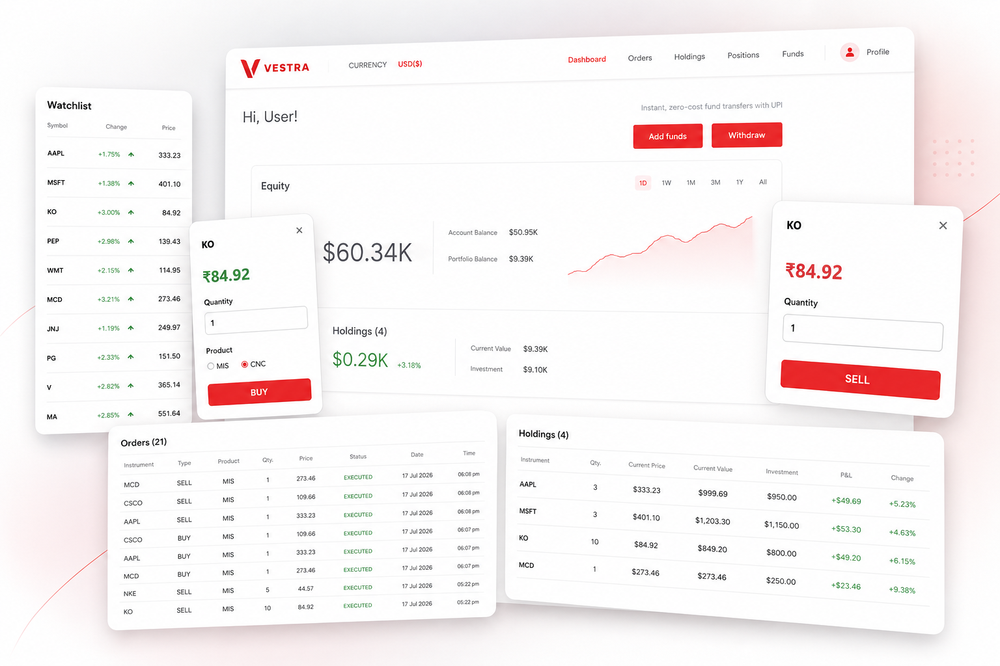
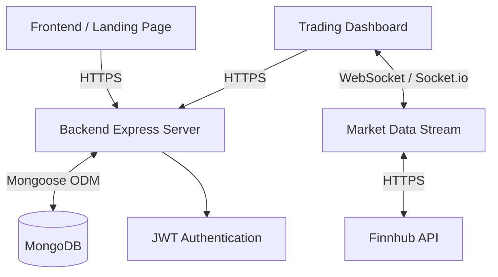
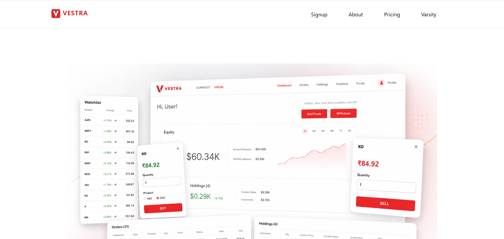
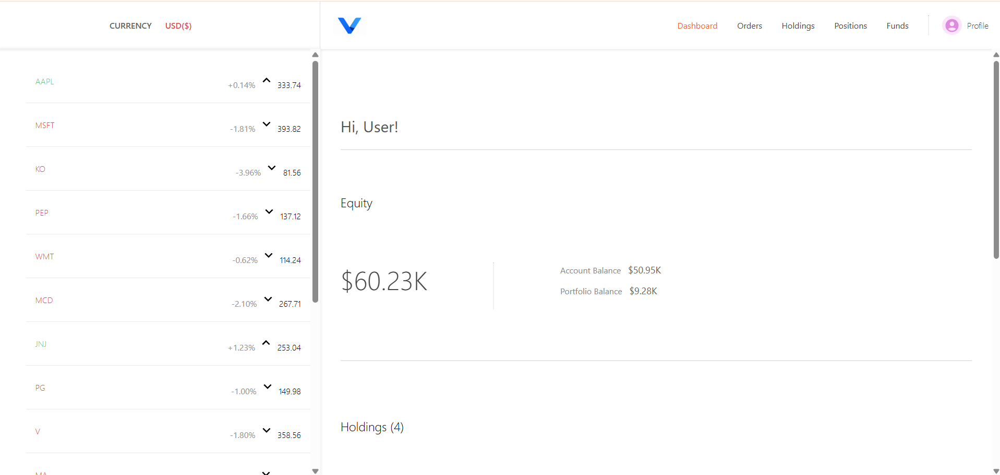
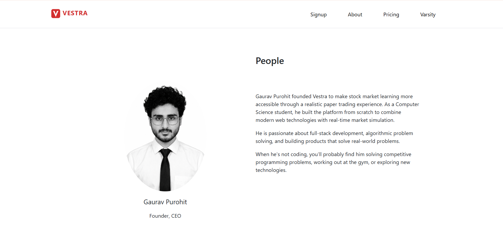
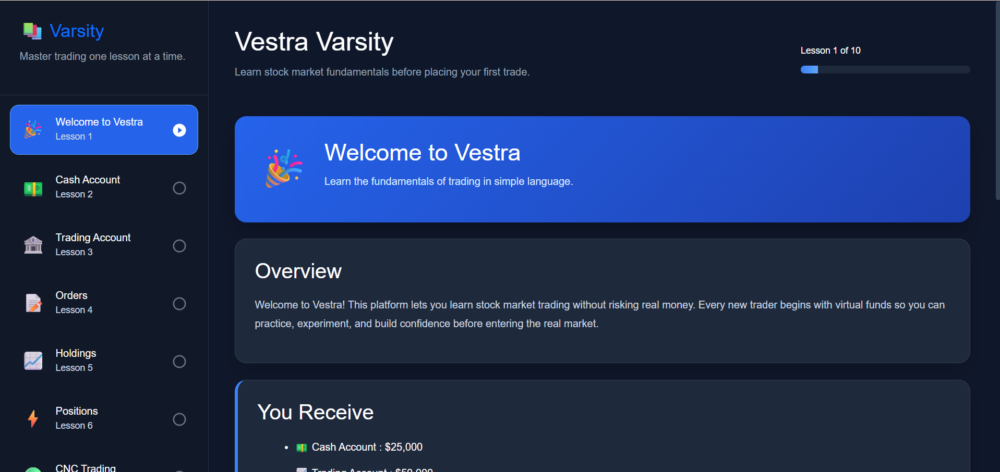

# VESTRA


A comprehensive MERN stack stock trading platform simulating real-time market data, paper trading, and educational resources. Vestra provides an immersive trading experience with live quotes, interactive charts, and a full suite of portfolio management tools.

## 📖 Table of Contents
- [Features](#-features)
- [Tech Stack](#-tech-stack)
- [Project Structure](#-project-structure)
- [Architecture](#-architecture)
- [Screenshots](#-screenshots)
- [Installation](#-installation)
- [Environment Variables](#-environment-variables)
- [API Overview](#-api-overview)
- [Future Improvements](#-future-improvements)
- [License](#-license)

## ✨ Features

| Feature | Description |
|---------|-------------|
| **User Authentication** | Secure signup/login using JWT and bcrypt password hashing. |
| **Live Market Data** | Real-time stock prices powered by WebSockets (Socket.io) and Finnhub API. |
| **Paper Trading** | Risk-free trading simulation with virtual currency. |
| **Portfolio Dashboard** | Interactive charts and portfolio summary using Chart.js. |
| **Holdings & Positions** | Track long-term investments and short-term open positions. |
| **Orders** | Comprehensive history of executed trades. |
| **Funds Management** | Virtual wallet to simulate deposits and withdrawals. |
| **Watchlist** | Curate and track favorite stocks in real-time. |
| **Confirmation Dialogs** | Secure trading actions with interactive confirmation prompts. |
| **Varsity Section** | Educational portal offering trading lessons and concepts. |
| **Responsive UI** | Mobile-ready layouts utilizing Material-UI and Bootstrap. |

## 🛠 Tech Stack

### Frontend (Dashboard & Landing/Varsity)
- React.js
- Material-UI (MUI)
- Bootstrap
- Chart.js (react-chartjs-2)
- React Router DOM
- Socket.io Client
- Parcel (Landing) / Create React App (Dashboard)

### Backend
- Node.js
- Express.js
- MongoDB (Mongoose ODM)
- Socket.io (WebSockets)
- JSON Web Token (JWT)
- bcrypt (Cryptography)
- Finnhub API

## 📂 Project Structure

```text
Vestra/
├── backend/            # Express server (APIs, WebSockets, DB Models)
├── dashboard/          # React App for the Trading Dashboard
└── frontend/           # React App for Landing & Varsity Educational Portal
```

## 🏗 Architecture



## 📸 Screenshots

| Landing Page | Trading Dashboard |
| :---: | :---: |
|  |  |

| Portfolio Summary | Varsity Education |
| :---: | :---: |
|  |  |

## 🚀 Installation

### 1. Clone the repository
```bash
git clone https://github.com/gauravpurohit685/Vestra.git
cd Vestra
```

### 2. Install dependencies
Open three separate terminals and install dependencies for each application module.

```bash
# Terminal 1: Backend
cd backend
npm install

# Terminal 2: Dashboard
cd dashboard
npm install

# Terminal 3: Frontend (Landing/Varsity)
cd frontend
npm install
```

### 3. Set up Environment Variables
Configure the necessary environment variables as outlined in the [Environment Variables](#-environment-variables) section.

### 4. Run the applications
Run the modules in their respective terminals:

```bash
# Terminal 1: Backend
cd backend
npm start

# Terminal 2: Dashboard
cd dashboard
npm start

# Terminal 3: Frontend
cd frontend
npm start
```

## 🔐 Environment Variables

The project requires specific environment variables for each module. Create a `.env` file in the root of each corresponding folder.

### `backend/.env`
```env
PORT=7777
DATABASE_URL=<your-mongodb-connection-string>
JWT_SECRET=<your-jwt-secret>
FINNHUB_API_KEY=<your-finnhub-api-key>
```

### `dashboard/.env`
```env
REACT_APP_VERIFY_API=http://localhost:7777/verify
REACT_APP_BACKEND_URL=http://localhost:7777/
REACT_APP_MARKET_URL=http://localhost:7777/market-data
REACT_APP_GETHOLDING=http://localhost:7777/holding
REACT_APP_GETPOSITION=http://localhost:7777/position
REACT_APP_GETBANK=http://localhost:7777/bank
REACT_APP_BUYHOLDING=http://localhost:7777/holding/buy
REACT_APP_SELLHOLDING=http://localhost:7777/holding/sell
REACT_APP_BUYPOSITION=http://localhost:7777/position/buy
REACT_APP_WITHDRAW=http://localhost:7777/bank/withdraw
REACT_APP_DEPOSIT=http://localhost:7777/bank/deposit
REACT_APP_GETORDER=http://localhost:7777/order
REACT_APP_CLOSEINDIVIDUALPOSITION=http://localhost:7777/position/close/
REACT_APP_GETPROFILE=http://localhost:7777/profile
REACT_APP_LOGOUT=http://localhost:7777/logout
REACT_APP_CLOSEALL=http://localhost:7777/position/closeall
REACT_APP_FRONTENDURL=http://localhost:1234/
```

### `frontend/.env`
```env
DASHBOARD_URL=http://localhost:3000/
VERIFY_API=http://localhost:7777/verify
LOGIN_API=http://localhost:7777/login
SIGNUP_API=http://localhost:7777/signup
```

## 🌐 API Overview

The backend follows RESTful principles and organizes routes logically by domain:

- **Auth**: `/signup`, `/login`, `/logout`, `/verify`
- **Bank (Funds)**: `/bank`, `/bank/withdraw`, `/bank/deposit`
- **Holdings**: `/holding`, `/holding/buy`, `/holding/sell`
- **Positions**: `/position`, `/position/buy`, `/position/close/:id`, `/position/closeall`
- **Orders**: `/order` (Retrieve execution history)
- **Profile**: `/profile` (User account management)
- **Market Data**: `/market-data` (Static snapshots)
- **WebSockets**: Real-time market data streaming connection via Socket.io.

## 🔮 Future Improvements

- Implementation of options and futures trading logic.
- Advanced charting features with technical indicators.
- Live notifications and alerts for executed orders or price targets.
- Social features for sharing portfolio milestones.

## 📄 License

This project is licensed under the [MIT License](LICENSE).
